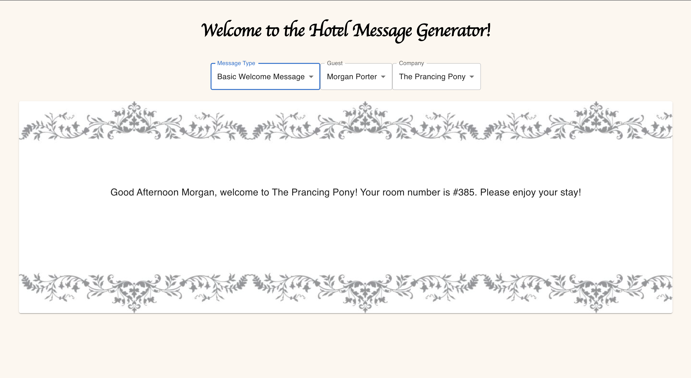
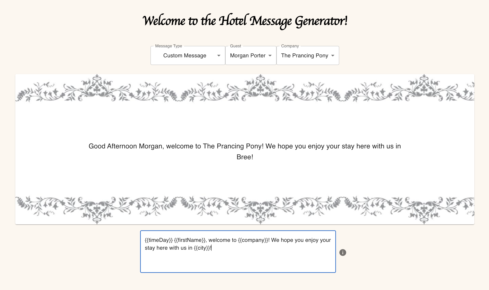

# Hotel Message Generator

## Description

*Duration: 4ish Hours over a couple days*

This application gives hotel staff a quick easy way to generate personalized or generalized messages to valued customers. 

## Screen Shots
___





## Installation
___

1. Fork and clone this repository.
2. Open the project using your editor of choice.
3. Run ```npm install``` in the terminal.
4. Run ```npm start``` in the terminal. Your browser will open a new tab with the application loaded!

## Usage
___

1. Choose a message type in the message drop down.
2. Choose the guest you would like to send a message to in the guest drop down.
3. Choose the company you are sending the message from in the company drop down.
4. Change you message type to see the different options pre loaded!
5. Or choose 'Custom Message' in the message drop down to create your own personalized message.
6. After clicking on 'Custom Message' a text field will appear with an information icon next to it. 
7. Click on the information icon to see how to structure your custom message.
8. Once you are happy with the message being displayed you can screenshot it and send it to your guest!

## Stack
___

I chose React.js and JavaScript because I wanted the user experience to be fluid and responsive. I chose MaterialUI for its ease of use and the previous experience I have with its structure and components.

This app is built without a database, so all the guests, companies, and messages are stored in JSON files that are imported into the .jsx files. And because there is no database refreshing will reset anything you've done, which is why I made the decision to not allow the user to save custom messages. 

A majority of the logic happens in the WelcomeMsg file, here is where the rendering of the message chosen as well as the guest information and company information is handled. Whichever message, guest, and company you choose is passed to this component with props in the HotelMain file. In the WelcomeMsg component, rendering of the messages is handled with a replace function, it will go through the message string looking for something like {{firstName}}, and replace it with the value you assign when you call the function. So {{firstName}} will end up being the first name of the selected guest. 

Throughout the project I made just to test my code and make sure it was working as I intended, the first issues I came across was how I wanted to handle custom messages that a user would input. Initially I tried to set up the JSON messages file to have a beginning of the message, middle, and end of message. But that severely limits the customization that a user has over their message. Then StackOverflow introduced me to the function I used, which is a mix of regex and .replace(). 

## Future Plans
___

Future plans for this application are to set up a database with PostgreSQL which will allow users to save, edit, and delete messages, guests, and companies. 

## Built With
___

- JavaScript
- React.js
- MaterialUI
- HTML/CSS

## Support
___

If you have suggestions or issues, please feel free to email me at [kayla.mir32@gmail.com](mailto:kayla.mir32@gmail.com).
